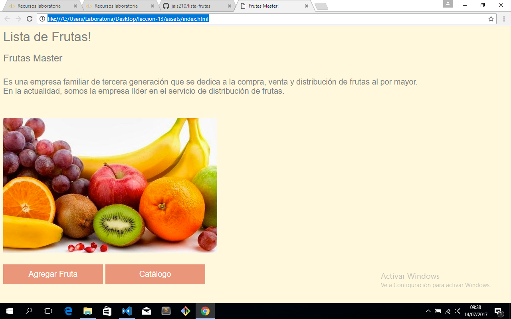

# Lista-Frutas
## * Empecemos!!!*
### 1. Crear una carpeta, a la cual puedes llamar "Lección-13" (es opcional, tú puedes ponerle un nombre más COOL!!!)
### 2. Dentro de esa carpeta creé otra carpeta, a la cual llamé "assets"
### 3. Dentro de la carpeta "assets" creé otra carpeta llamada "Javascript", en dicha carpeta guardé el archivo Javascript
### 4. También dentro de esa carpeta creé una carpeta llamada CCS para que mi página tenga una visiualización muy linda, en dicha carpeta está mi archivo CCS
### 5. Ahora, como ya tengo listo todo mi ambiente de trabajo, creo mi respositorio en Gitup. Obviamente para hacer este paso, ya debes de tener tu cuenta en Gitup.
### 6. Luego, hay que vincular mi respositorio con mi carpeta local para guardar todos los cambios que se están haciendo
### 7. Una vez vinculados, solo hay que commitear y pusher cada vez que modifiquemos un archivo en javascript, HTML o CCS
### 8. Finalmente así es como quedó mi página :) 

